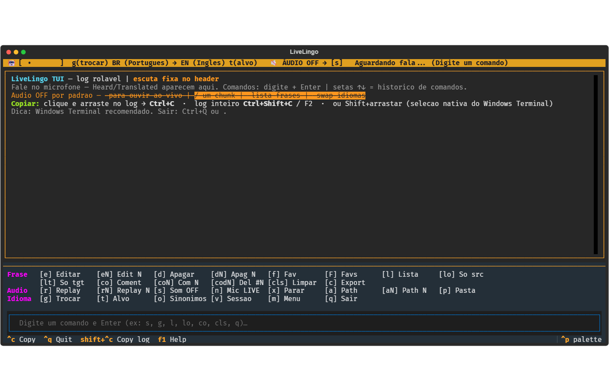

# 🎙️ LiveLingo2 — Tradução de Voz em Tempo Real para Windows

[](https://github.com/rcoproc/livelingo2/actions/workflows/ci.yml)
[](https://www.python.org/downloads/)
[](tests/)
[](scripts/check_deps_security.py)
[](LICENSE)

> **English:** full docs in [`README.md`](README.md).  
> **Mais capturas de tela:** [`screenshots.md`](screenshots.md).

**LiveLingo2** transforma sua fala em outro idioma **ao vivo**, num microfone virtual — para que Microsoft Teams (ou Zoom, Discord, Google Meet, OBS…) ouça a tradução como se fosse seu microfone. Você fala **francês**, os outros ouvem **inglês** (ambos os idiomas são configuráveis).

<p align="center">
  
</p>

<p align="center"><em>Interface TUI: header com par de idiomas e áudio OFF, área de log rolável, faixa de atalhos (Frase / Áudio / Idioma) e campo de comando. Outras telas em <a href="screenshots.md">screenshots.md</a>.</em></p>

Além da tradução em tempo real, o projeto evoluiu para uma **ferramenta de reuniões multilíngues** com histórico persistente por sessão, comandos interativos no terminal, exportação de transcrições com resumo executivo por IA e auxiliar de vocabulário.

```text
🎤 Microfone real
   └─► STT (Whisper local ou Groq cloud)
        └─► Tradução (Google ou LLM Groq)
             └─► TTS (edge-tts | Piper local | hybrid)
                  └─► VB-Cable (CABLE Input)
                       └─► Teams usa "CABLE Output" como mic
```

**O que precisa de internet?** Depende do motor escolhido em cada etapa — veja a seção [O que funciona offline vs online](#o-que-funciona-offline-vs-online) abaixo. Em resumo: a **tradução** quase sempre precisa de rede (Groq ou Google); o **áudio (TTS)** pode ser local com Piper; o **STT** pode ser local com faster-whisper.

---

## Visão geral

### Propósito principal

O caso de uso central é: **você fala em um idioma (ex.: francês) e os participantes da reunião ouvem em outro (ex.: inglês)** — sem precisar trocar de idioma manualmente.

### Arquitetura técnica

O projeto é modular, com pipeline multi-thread:

| Módulo | Responsabilidade |
|--------|------------------|
| `main.py` | Ponto de entrada, sessões, menu de comandos |
| `config.py` | Configuração central via `.env` |
| `livelingo/capture.py` | Captura de áudio + VAD (detecção de voz) |
| `livelingo/transcribe.py` | Whisper local (faster-whisper) |
| `livelingo/groq_transcribe.py` | Whisper na nuvem Groq |
| `livelingo/failover.py` | HA runtime: STT Groq→local, LLM→Google (circuit breaker) |
| `livelingo/translate.py` | Google Translate (grátis) |
| `livelingo/llm.py` | Tradução via LLM Groq (mais natural) |
| `livelingo/synthesize.py` | Factory TTS (edge / Piper / hybrid) |
| `livelingo/piper_tts.py` | TTS local Piper (ONNX, offline após download) |
| `livelingo/hybrid_tts.py` | edge no 1º chunk + Piper no resto (baixa latência) |
| `livelingo/playback.py` | Saída para VB-Cable / monitor |
| `livelingo/pipeline.py` | Orquestração com 3 threads + mute de áudio + gate de mic no TTS |
| `livelingo/mic_control.py` | Mute do mic no Windows (Core Audio / pycaw) + gate do app |
| `livelingo/stt_filter.py` | Filtro de alucinações do Whisper (créditos, silêncio) |
| `livelingo/vad_silero.py` | VAD neural opcional (Silero) |
| `livelingo/tts_segments.py` | Divisão de texto para TTS em streaming |
| `livelingo/db.py` | Persistência SQLite |
| `livelingo/devices.py` | Descoberta e resolução de dispositivos |
| `livelingo/ui.py` | Interface terminal colorida |

### Pipeline (3 threads)

```text
[Recorder Thread]  mic → chunk_queue
[Processor Thread] chunk_queue → STT → tradução → TTS → playback_queue
[Playback Thread]  playback_queue → VB-Cable / monitor
```

1. **Recorder** — captura áudio do microfone em chunks (VAD ou fixo); pode pausar emissão enquanto o TTS toca
2. **Processor** — STT → tradução → TTS
3. **Playback** — envia áudio sintetizado para o dispositivo virtual; com `MUTE_CAPTURE_DURING_PLAYBACK` fecha o gate de STT durante a reprodução

---

## Funcionalidades

### 1. Tradução de voz em tempo real

- Captura contínua do microfone
- VAD (Voice Activity Detection) para cortar em frases naturais
- Latência típica de ~3–6 s até o primeiro áudio (`hear`), ou ~5 s no total do chunk com perfil hybrid (Groq + edge + Piper)
- Métricas por chunk: `STT`, `translate`, `TTS`, `first_audio`, `tts_start`, `hear`, `total`
- Indicador visual animado no terminal (🎙️ ouvindo / 🤖 aguardando)
- Modo verbose com `--verbose` para logs detalhados de debug

### 2. Múltiplos motores de STT

| Motor | Quando usar |
|-------|-------------|
| **Groq cloud** (`whisper-large-v3`) | Melhor precisão, recomendado com API key |
| **Local** (`faster-whisper`) | Offline, usa CPU/GPU local |
| **Auto** | Groq se tiver key, senão local |

Se a key Groq ou a rede falharem na **inicialização**, o LiveLingo faz fallback para o Whisper local. Com HA padrão, falhas **durante a sessão** (timeout / 429 / rede) também caem no Whisper local **sem fechar a app** — ver [Failover de provedores (HA)](#failover-de-provedores-ha).

### 3. Múltiplos motores de tradução

| Motor | Qualidade |
|-------|-----------|
| **LLM Groq** (`llama-3.3-70b`) | Corrige erros de STT e traduz de forma natural |
| **Google Translate** | Grátis, sem key, mais literal |
| **Auto** | LLM se tiver `GROQ_API_KEY`, senão Google |

Com HA padrão, se o LLM falhar **mid-session**, a tradução tenta **Google** automaticamente (ainda precisa de internet). Offline total (modo avião) derruba LLM **e** Google — o STT local pode continuar, a tradução cloud não.

### 4. Múltiplos motores de TTS

| Motor | Internet | Latência | Observação |
|-------|----------|----------|------------|
| **edge** (`TTS_ENGINE=edge`) | Sim | Baixa (~0,5 s no 1º áudio) | Vozes Microsoft via edge-tts |
| **piper** (`TTS_ENGINE=piper`) | Não* | Média/alta na CPU Windows | ONNX local; `pip install piper-tts onnxruntime` |
| **hybrid** (`TTS_ENGINE=hybrid` ou `TTS_HYBRID=true` com piper) | Parcial | **Melhor equilíbrio** | 1º chunk edge (rápido) + resto Piper (local) |

\* Após o download único do modelo de voz em `.cache/models/piper`.

### 5. Sessões persistentes (SQLite)

Ao iniciar, o aplicativo oferece:

- **[1] Nova sessão** — com título personalizado ou automático
- **[2] Retomar sessão** — carrega histórico, favoritos e áudio anterior
- **[99] Deletar sessão** — remoção atômica (banco + cache de áudio)

Cada chunk é salvo em `.cache/audio_sessions/{session_id}/` e registrado em `livelingo.db`.

### 6. Comandos interativos no terminal

Durante a escuta, digite comandos no terminal (menu em duas colunas, `m` reexibe):

| Comando | Ação |
|---------|------|
| `r` / `rN` | Repetir áudio do último chunk ou do chunk N (gera TTS sob demanda se faltar WAV) |
| `e` / `eN` | Editar e retraduzir frase (TUI: campo já vem com o texto da frase) |
| `enew <texto>` | Nova tradução só com texto (sem mic); TTS se som ON |
| `d` / `dN` | Deletar chunk (com confirmação) |
| `f` / `fN` | Favoritar frase |
| `F` | Listar favoritos (modal) |
| `c` | Exportar histórico para `.md` com resumo IA + contagem de palavras |
| `s` | **Sound ON/OFF** — ligar/desligar áudio da tradução (texto continua) |
| `g` | **Swap idiomas** — inverte `SOURCE ↔ TARGET` (STT + tradução + voz TTS) |
| `t` / `t EN` | **TARGET** — muda só o idioma alvo (códigos em **CAIXA ALTA**; aceita one-liner) |
| `n` | **Mic mute** — mute do microfone no Windows (tray) + gate de captura do app |
| `b` / `bypass` | **Bypass de voz** — mic cru → CABLE (Teams) **sem** tradução; `[b]` de novo retoma a escuta/tradução |
| `x` | Interromper leitura TTS em andamento |
| `o` | Buscar sinônimos / significado de palavra |
| `l` | Listar mensagens da sessão (timing, timestamp, comentários `#id`) |
| `lo` / `lt` | Listar só source (ouvido) / só target (traduzido) |
| `co` / `coN` / `coN texto` | Comentar o último chunk ou o chunk N (SQLite; aparece no `l`) |
| `codN` | Apagar comentário pela PK `#N` (sem confirmação) |
| `cls` | Limpar **LC + VOZ + Sistema** (TUI) / limpar terminal (classic) |
| `cls1` / `cls2` | Limpar só **LC** (esquerda) / só **VOZ** (direita) |
| `gg` / `GG` (ou `gt` / `gf`) | **Go top** / **Go bottom** — início ou fim do painel de log **focado** |
| `u` / `F4` | **UI compacta** — oculta menu de comandos; linha de comando permanece |
| `F5` / chip auto-scroll | **Trava auto-scroll** da Tradução **LC + VOZ** — ON (verde) segue o fim; OFF (âmbar) congela a vista (linhas ainda entram). Rodapé: `Auto↓ ON` / `Auto↓ OFF` |
| `ld` | Listar dispositivos de áudio (`python list_devices.py`) no log |
| `lav` | Listar todas as vozes edge-tts (`edge-tts --list-voices`) no log |
| `lv` | Listar vozes filtradas (`en-US|en-GB|es-ES|es-MX|fr-FR`) no log |
| `ctts <ShortName>` | Alterar `TTS_VOICE` (one-liner ou prompt; **sem** popup modal) |
| `v` | Trocar ou reiniciar sessão |
| `m` | Mostrar menu de comandos |
| `q` | Sair da aplicação |

**TUI (atalhos):** `F1` ajuda → aba **Sistema**; `F3` cicla Tradução → Sistema → Novidades → Lista de comandos; `F4` UI compacta; **`F5` / chip auto-scroll** trava/liga follow-to-bottom em **LC + VOZ**; `Ctrl+C` copia seleção; `Ctrl+Shift+C` copia o painel focado (em Tradução: LC ou VOZ); **`F2` / chip bypass / `[b]`** = bypass de voz (não copia log); `/texto` busca no painel focado; `↑`/`↓` histórico de comandos; palette **Screenshot** grava SVG+PNG e copia a **imagem** para a área de transferência.

**Abas de log:** **Tradução** = split vertical **LC** (esquerda, só pares LiveCaptions estáveis) | **VOZ** (direita, chunks mic + saída de comandos) — arraste a barra **║** (duplo-clique = 50/50); **Expandir/Restaurar** no cabeçalho **VOZ** (direita); clique no painel para focar busca/cópia/scroll; faixa **Live Captions** no topo com borda inferior `═ ↕ captions ═` redimensionável. **Sistema** = etapas STT/tradução/TTS, VAD, timings, debug e F1. **Novidades** = `CHANGELOG.md`. **Lista de comandos** = ajuda agrupada.
**Retomar sessão sem menu:** `python main.py <session_id>` ou `livelingo <session_id>` (id exibido ao sair).

Com **som OFF** (`s`): o texto traduzido aparece na hora; com `TTS_SKIP_WHEN_MUTED=true` o TTS é omitido (replay `r` sintetiza depois). Nada vai para o VB-Cable. Com **som ON** de novo, as próximas frases voltam a tocar.

Com **`SENTENCE_SPLIT=true`** (padrão) e áudio OFF: uma **pausa curta** após fala mínima emite a frase como chunk próprio (STT+tradução+UI) **sem** esperar o monólogo inteiro. Ajuste `SENTENCE_SILENCE` / `SENTENCE_MIN_SPEECH` no `.env`. Com som ON, o split por frase fica desligado por padrão (`SENTENCE_SPLIT_SOUND_OFF_ONLY=true`).

Com **bypass** (`b`): a voz vai **direto** ao `OUTPUT_DEVICE` (CABLE Input → Teams em CABLE Output), sem STT/tradução. Escuta de tradução pausada. `[b]` de novo retoma o fluxo normal — útil para falar inglês (ou outro idioma) na call.

Com **mic mutado** (`n`): o Windows mostra o mic mudo (quando pycaw funciona) e o LiveLingo não emite chunks de STT. Pressione `n` de novo para reativar.

Com **swap** (`g`): inverte a direção ao vivo (ex. `EN → PT` vira `PT → EN`). A linha amarela do menu mostra o par atual. O histórico antigo **não** é re-traduzido — só os próximos chunks. Configure `TTS_VOICE` (voz do target) e opcionalmente `TTS_VOICE_ALT` (voz do outro idioma do par) para o áudio trocar de sotaque corretamente.

### 7. Exportação com resumo executivo IA

O comando `c` gera um arquivo Markdown (`AAAA-MM-DD_titulo.md`) contendo:

- **Resumo executivo** (assunto principal, resumo objetivo, tarefas/ações) via LLM Groq
- **Transcrição detalhada** chunk a chunk (idioma alvo + idioma de origem; layout limpo sem timing no corpo)
- **Contagem de palavras** do texto de origem (conteúdo multissilábico; ignora `e` / `a` / `ou` / `para` / `ao` / `à`)
- **Vocabulário e sinônimos** consultados durante a sessão

Requer `GROQ_API_KEY` para o resumo automático.

### 8. Auxiliar de vocabulário

Comando `o`: explica uma palavra (WordNet offline por padrão, ou LLM via Groq). Configure `SYNONYMS_ENGINE=wordnet|llm|auto` no `.env`.

### 9. Monitor de áudio

Com `MONITOR_PLAYBACK=true`, a tradução também é reproduzida nos seus fones/alto-falantes enquanto é enviada para o VB-Cable — útil para testes ou para ouvir a si mesmo durante a chamada.

### 10. Anti-feedback (loop speaker → microfone)

Quando a saída de TTS e o microfone são do **mesmo notebook** (speakers abertos + mic interno), o app pode “ouvir” a própria tradução e entrar em loop.

Com `MUTE_CAPTURE_DURING_PLAYBACK=true` (padrão):

1. Enquanto o TTS toca, o gate de captura **pausa** a emissão de chunks de STT (só no app — **não** mexe no mute do tray).
2. Após o fim do áudio, espera `MUTE_CAPTURE_HANGOVER_MS` (padrão 350 ms) para a cauda do speaker e reabre o mic.
3. Coexiste com o mute manual `n`: se o mic estiver mutado pelo usuário, não reabre sozinho.

**Recomendado em chamada real:** fones + `OUTPUT_DEVICE=CABLE Input` (Teams em CABLE Output). O gate é rede de segurança para testes no speaker.

### 11. Idiomas alinhados (STT prompt + voz TTS)

Trocar só `SOURCE_LANG` / `TARGET_LANG` **não basta** se outras chaves ficarem de um par antigo:

| Config | Deve combinar com | Se errar |
|--------|-------------------|----------|
| `STT_INITIAL_PROMPT` | **Mesmo idioma** que `SOURCE_LANG` (ou vazio) | Whisper “Heard” no idioma errado → tradução tipo portunhol |
| `TTS_VOICE` (edge) | Prefixo do locale = `TARGET_LANG` (`fr-FR-*`, `es-ES-*`, `en-US-*`…) | Texto certo, **sotaque** da voz errada |
| `PIPER_VOICE` | Voz Piper do idioma alvo (ou vazio = auto por `TARGET_LANG`) | Sotaque / idioma falado errado |

Na inicialização o app **avisa** se o prompt de STT parece de outro idioma que `SOURCE_LANG`, ou se o locale de `TTS_VOICE` não bate com `TARGET_LANG`.

#### Vozes Edge elegantes (referência rápida)

No `.env`: `TTS_VOICE=nome-exato` (locale deve bater com `TARGET_LANG`).

**Listar todas as vozes disponíveis** (Microsoft Edge neural):

```powershell
edge-tts --list-voices
```

Filtrar EN / ES / FR (PowerShell):

```powershell
edge-tts --list-voices | Select-String "en-US|en-GB|es-ES|es-MX|fr-FR"
```

Linux / WSL / macOS:

```bash
edge-tts --list-voices | grep -E "en-US|en-GB|es-ES|es-MX|fr-FR"
```

Seleção **elegante / educada** (reuniões, apresentações) — 2 masculinas e 2 femininas por idioma:

| Idioma | Gênero | `TTS_VOICE` | Perfil |
|--------|--------|-------------|--------|
| **Inglês** (`en`) | Feminino | `en-US-AriaNeural` | Clara, profissional (EUA) — padrão clássico |
| **Inglês** (`en`) | Feminino | `en-GB-SoniaNeural` | Britânica polida, tom formal |
| **Inglês** (`en`) | Masculino | `en-GB-RyanNeural` | Britânico sóbrio, reunião executiva |
| **Inglês** (`en`) | Masculino | `en-US-ChristopherNeural` | Americano calmo e articulado |
| **Espanhol** (`es`) | Feminino | `es-ES-ElviraNeural` | Espanha, dicção limpa e formal |
| **Espanhol** (`es`) | Feminino | `es-MX-DaliaNeural` | México, natural e educada |
| **Espanhol** (`es`) | Masculino | `es-ES-AlvaroNeural` | Espanha, grave e profissional |
| **Espanhol** (`es`) | Masculino | `es-MX-JorgeNeural` | México, sóbrio e confiante |
| **Francês** (`fr`) | Feminino | `fr-FR-DeniseNeural` | França, elegante e neutra |
| **Francês** (`fr`) | Feminino | `fr-FR-EloiseNeural` | França, clara e cordial |
| **Francês** (`fr`) | Masculino | `fr-FR-HenriNeural` | França, formal e pausado |
| **Francês** (`fr`) | Masculino | `fr-FR-AlainNeural` | França, tom maduro e educado |

Exemplo no `.env` (EN → FR, voz masculina elegante):

```env
SOURCE_LANG=en
TARGET_LANG=fr
TTS_VOICE=fr-FR-HenriNeural
```

> Multilingual (`*MultilingualNeural`) leem vários idiomas, mas **mantêm o sotaque do locale** da voz. Prefira `fr-FR-*` para francês nativo, `es-ES-*` / `es-MX-*` para espanhol, etc.

---

## O que funciona offline vs online

Cada etapa do pipeline é independente. **Não existe modo 100% offline completo** hoje (a tradução sempre usa Groq ou Google), mas dá para deixar **STT e TTS locais** e usar internet só na tradução.

| Etapa | Motor típico (recomendado) | Precisa internet? |
|-------|---------------------------|-------------------|
| **STT** (voz → texto) | Groq Whisper | **Sim** |
| **STT** | faster-whisper local | **Não** (após baixar o modelo) |
| **Tradução** | Groq LLM | **Sim** |
| **Tradução** | Google Translate | **Sim** |
| **TTS 1º chunk** (modo `hybrid`) | edge-tts | **Sim** |
| **TTS resto** (modo `hybrid`) | Piper | **Não** (após baixar a voz) |
| **TTS completo** (modo `piper`) | Piper | **Não** (após baixar a voz) |
| **TTS** (modo `edge`) | edge-tts | **Sim** |

### Perfil atual típico (hybrid + Groq)

```text
Mic → Groq STT (internet)
    → Groq tradução (internet)
    → edge no 1º pedaço (internet) + Piper no resto (local)
    → VB-Cable
```

Boa latência (`hear` ~3–4 s), mas **ainda depende de internet** para ouvir e traduzir.

### Perfil “máximo offline possível” hoje

No `.env`:

```env
STT_ENGINE=local
TRANSLATION_ENGINE=google
TTS_ENGINE=piper
TTS_HYBRID=false
```

| Componente | Resultado |
|------------|-----------|
| Áudio (TTS) | Offline após download do modelo Piper |
| STT | Offline (Whisper na CPU) |
| Tradução | **Ainda precisa de internet** (Google) |

> Tradução **100% offline** (LLM local, ex. Ollama) ainda **não está integrada** ao LiveLingo.
> HIT no **phrase cache** (`PHRASE_CACHE=true`) pode evitar rede em frases já vistas.

### Failover de provedores (HA)

Wrappers em `livelingo/failover.py` mantêm a sessão viva se a nuvem falhar:

| Camada | Primário | Fallback automático (padrão) |
|--------|----------|------------------------------|
| **STT** | Groq Whisper | faster-whisper local (`STT_FALLBACK=local`) |
| **Tradução** | Groq LLM | Google Translate (`TRANSLATION_FALLBACK=google`) |

- Erros transitórios (timeout, 429, DNS/rede): até `FAILOVER_MAX_RETRIES` no primário, depois secondary. **Circuit breaker** evita martelar API morta por `CIRCUIT_COOLDOWN_S` segundos.
- Erros permanentes (401 / modelo 404): circuito aberto; só secondary.
- Self-test no boot **não encerra** a app se existir fallback.
- Whisper local pode aquecer em thread de fundo (`STT_WARMUP_LOCAL=true`).
- Painel Sistema: linhas `[ha] …` com rate-limit.

Desligar HA (não recomendado em sessão ao vivo):

```env
STT_FALLBACK=none
TRANSLATION_FALLBACK=none
```

### Perfil “máxima velocidade” (recomendado em chamadas)

```env
STT_ENGINE=groq
TRANSLATION_ENGINE=llm
GROQ_MODEL=llama-3.1-8b-instant
TTS_ENGINE=hybrid
# ou: TTS_ENGINE=piper + TTS_HYBRID=true
LOW_LATENCY=true
STREAMING_LLM=true
STREAMING_TTS_OVERLAP=true
PIPER_MERGE_TAIL=true
```

---

## 1. Pré-requisitos

| Requisito | Observação |
|-----------|------------|
| **Windows 10/11** | O tool usa APIs de áudio do Windows (MME via PortAudio). WSL/Linux via `livelingo.sh`. |
| **Python 3.10+** | 3.10 – 3.12 recomendado. Verifique com `python --version`. |
| **VB-CABLE** | Cabo de áudio virtual gratuito. Download: **<https://vb-audio.com/Cable/>** |
| **Internet** | Necessária para tradução; TTS edge/hybrid no 1º chunk; opcional se usar só Piper + STT local (tradução Google ainda precisa de rede). |

### Instalar VB-CABLE

1. Baixe o zip do VB-CABLE em <https://vb-audio.com/Cable/>.
2. Extraia e **clique com o botão direito em `VBCABLE_Setup_x64.exe` → Executar como administrador**.
3. Clique em **Install Driver**.
4. **Reinicie o Windows** (importante — o dispositivo pode não aparecer de forma confiável sem isso).

Após reiniciar, você terá dois novos dispositivos:

- **CABLE Input (VB-Audio Virtual Cable)** — dispositivo de *reprodução*. **O LiveLingo envia o áudio traduzido para cá.**
- **CABLE Output (VB-Audio Virtual Cable)** — dispositivo de *gravação*. **O Teams seleciona este como microfone.**

---

## 2. Instalação

Na pasta do projeto:

```powershell
# (opcional, mas recomendado) criar ambiente virtual
python -m venv .venv
.\.venv\Scripts\Activate.ps1

# instalar dependências
python -m pip install --upgrade pip
pip install -r requirements.txt
```

> Com o motor STT **local**, a primeira execução baixa o modelo Whisper (`small` ≈ 0,5 GB, `medium` ≈ 1,5 GB) em `~/.cache/huggingface` — automático, aguarde uma vez. Com o motor **Groq** (recomendado), nenhum download é necessário.

### Segurança de dependências (produção)

O LiveLingo acompanha o **OWASP Top 10 A06** (*Vulnerable and Outdated Components*)
para as deps Python em [`requirements.txt`](requirements.txt).

**Pisos de segurança** (não faça downgrade):

| Pacote | Mínimo | Motivo |
|--------|--------|--------|
| `python-dotenv` | **≥ 1.2.2** | CVE-2026-28684 (symlink em `set_key` / `unset_key`) |
| `requests` | **≥ 2.33.0** | CVE-2026-25645 (caminho temporário previsível na extração zip) |
| `urllib3` | **≥ 2.7.0** | Piso transitivo para advisories de decompress / DoS |

`deep-translator==1.11.4` é a última release legítima. O advisory
**PYSEC-2022-252** é *histórico* (tomada de conta no PyPI) e **não tem versão
corrigida**; os pacotes maliciosos foram removidos. O script de auditoria
coloca isso em allowlist (`KNOWN_FALSE_POSITIVES` no checker).

**Auditoria + testes antes de subir em produção**

Instale as ferramentas de dev uma vez (`pytest`, `pip-audit`, `ruff`):

```powershell
pip install -r requirements.txt
pip install -r requirements-dev.txt
```

#### Integração contínua (GitHub Actions)

Em todo push em `main` / `master` e em todo pull request, o workflow
[`.github/workflows/ci.yml`](.github/workflows/ci.yml) roda em **Python 3.10 e 3.12**:

1. **Segurança** — `python scripts/check_deps_security.py --project-only --fail-on vuln`
2. **Testes** — `python -m pytest tests/ -q`

O badge **CI** no topo deste README reflete o último run na branch padrão:
[Actions → CI](https://github.com/rcoproc/livelingo2/actions/workflows/ci.yml).

Localmente o mesmo critério: `bash scripts/run_checks.sh` (inclui format opcional).

#### Checks em um comando (WSL / Linux) — recomendado

[`scripts/run_checks.sh`](scripts/run_checks.sh) executa, nesta ordem:

1. **Format** — `ruff format` + correção segura de imports (fallback: `black`/`isort` se existirem)
2. **Segurança** — `python3 scripts/check_deps_security.py --project-only`
3. **Testes** — `python3 -m pytest tests/`

```bash
# na raiz do projeto (WSL)
cd /mnt/c/Users/rcopr/LiveLingo/LiveLingo   # ajuste o caminho se precisar
bash scripts/run_checks.sh
# ou:  ./scripts/run_checks.sh
```

Flags úteis do `run_checks.sh`:

| Flag | Significado |
|------|-------------|
| `--skip-format` | Pula ruff/black |
| `--fail-on vuln` | Default: falha só com **CVE** (pacote desatualizado = aviso) |
| `--fail-on any` | Falha se houver CVE **ou** pacote desatualizado |
| `--fail-on outdated` | Falha com desatualizados (e vulns) |
| `--pytest -v` | Args extras repassados ao pytest |
| `--no-project-only` | Audita o ambiente inteiro, não só deps do projeto |

#### Passos manuais (Windows PowerShell / qualquer shell)

```powershell
python -m pytest tests/ -v
python scripts/check_deps_security.py --project-only
```

Flags úteis do `check_deps_security.py`:

| Flag | Significado |
|------|-------------|
| `--project-only` | Só pacotes do `requirements.txt` (+ pisos de segurança) |
| `--fail-on any` | Sai com erro se houver **qualquer** vuln **ou** pacote desatualizado |
| `--json report.json` | Relatório completo em JSON |
| `--ignore-vuln ID` | Ignora advisory extra (CVE / PYSEC / GHSA) |
| `--no-default-ignores` | Desliga a allowlist histórica embutida |

**Como ler o checklist de segurança**

| Marca | Significado |
|-------|-------------|
| `✓` | OK |
| `!` | **Só aviso** (ex.: existe versão mais nova no PyPI — **não** é CVE) |
| `✗` | Ação necessária (scan falhou ou vulnerabilidade acionável) |

- **“Componentes desatualizados monitorados (scan PyPI)”** = o scan de outdated **rodou** (✓), não “tudo está na última versão”.
- **“Deps do projeto na última versão do PyPI”** pode mostrar `!` para pacotes como `sounddevice` / `soundfile` quando há release mais nova. Isso é **frescor**, não buraco de segurança.
- Default `--fail-on vuln` → **EXIT 0** se não houver CVE acionável, mesmo com alguns pacotes desatualizados.
- Linha de status: `WARN (só frescor)` = seguro para deploy do ponto de vista de segurança; atualize quando puder e reteste áudio.
- Para o CI falhar com outdated: `--fail-on any` (ou `--fail-on outdated`).

Códigos de saída (`check_deps_security.py` / script de checks):

| Código | Significado |
|--------|-------------|
| `0` | OK para o critério `--fail-on` escolhido |
| `1` | Achado acionável (vuln e/ou outdated, conforme flags) |
| `2` | Erro de ferramenta/scan (ex.: pip-audit não rodou) |

Módulos de áudio que dependem de PortAudio podem ser **pulados** em CI headless/WSL;
isso não impede os testes de piso de segurança nem os mocks do pipeline.

### Scripts de atalho

O projeto gera automaticamente:

- `livelingo.bat` — Windows
- `livelingo.sh` — Linux/WSL/macOS

---

## 3. Encontrar os índices dos dispositivos

```powershell
python list_devices.py
```

Lista todos os dispositivos de áudio com seu **índice**, marcando entradas (verde), saídas (magenta) e o VB-Cable. Exemplo:

```text
idx   in out  host API       name
  1    2   0  MME            Microphone (Realtek Audio)      <- default-in
  8    0   2  MME            CABLE Input (VB-Audio Virtual Cable)   <- VB-CABLE
 12    0   2  MME            Speakers (Realtek Audio)        <- default-out
```

Anote o índice do **seu microfone** e do **CABLE Input**.

---

## 4. Configuração

Os padrões (mic = padrão do sistema, saída = `CABLE Input`) costumam funcionar sem ajustes. Para personalizar, edite [`config.py`](config.py) ou copie o arquivo de exemplo:

```powershell
Copy-Item .env.example .env
notepad .env
```

### Configurações comuns

| Configuração | Padrão | Significado |
|--------------|--------|-------------|
| `SOURCE_LANG` | `fr` | Idioma que você fala |
| `TARGET_LANG` | `en` | Idioma que os outros ouvem |
| `STT_ENGINE` | `auto` | `auto`/`groq`/`local` — Groq cloud vs local |
| `GROQ_STT_MODEL` | `whisper-large-v3` | Modelo Groq STT (`whisper-large-v3-turbo` = mais rápido) |
| `STT_INITIAL_PROMPT` | *(vazio)* | Dica de vocabulário — **no mesmo idioma** que `SOURCE_LANG` (ou vazio) |
| `STT_HALLUCINATION_FILTER` | `true` | Descarta créditos/alucinações de silêncio do Whisper |
| `WHISPER_MODEL` | `small` | Modelo local: `tiny`/`base`/`small`/`medium`/`large-v3`/`large-v3-turbo` |
| `INPUT_DEVICE` | *(mic padrão)* | Índice ou substring do nome do microfone |
| `OUTPUT_DEVICE` | `CABLE Input` | Dispositivo VB-Cable de reprodução |
| `TTS_ENGINE` | `edge` | `edge` / `piper` / `hybrid` |
| `TTS_HYBRID` | `true` (Windows) | Com `piper`: 1º chunk edge + resto Piper |
| `TTS_VOICE` | `en-US-AriaNeural` | Voz Edge do **target**; **locale = TARGET_LANG** (ver *Vozes Edge elegantes*) |
| `TTS_VOICE_ALT` | *(auto no swap)* | Voz do outro idioma do par; usada no comando `[g]` (swap) |
| `PIPER_VOICE` | *(auto)* | Voz Piper local (ex. `en_US-lessac-medium`) |
| `PIPER_QUALITY` | `fast` (Windows) | `fast` = voz `*-low` (CPU mais rápida) |
| `PIPER_MERGE_TAIL` | `true` | Funde o resto do texto numa só chamada Piper |
| `STREAMING_TTS_OVERLAP` | `true` | Inicia TTS na 1ª cláusula enquanto o LLM traduz |
| `CHUNK_DURATION` | `4.0` | Duração alvo/fixa do chunk (segundos) |
| `VAD_ENABLED` | `true` | Cortar nas pausas (true) vs chunks fixos (false) |
| `SILENCE_THRESHOLD` | `0.015` | Limiar de volume para detecção de fala |
| `MONITOR_PLAYBACK` | `false` | Também reproduzir a tradução nos seus alto-falantes |
| `MONITOR_DEVICE` | *(saída padrão)* | Dispositivo do monitor (índice/nome) |
| `MUTE_CAPTURE_DURING_PLAYBACK` | `true` | Pausa o gate STT enquanto o TTS toca (anti-loop acústico) |
| `MUTE_CAPTURE_HANGOVER_MS` | `350` | Espera (ms) após o TTS antes de reabrir o mic |
| `TTS_SKIP_WHEN_MUTED` | `true` | Com sound OFF (`s`), omite TTS (só texto; `r` sintetiza depois) |
| `PLAYBACK_INTERRUPT` | `true` | Corta TTS antigo quando chega chunk novo |
| `TRANSLATION_ENGINE` | `auto` | `auto`/`llm`/`google` |
| `GROQ_API_KEY` | *(vazio)* | Key Groq gratuita → STT cloud + tradução LLM melhores |
| `GROQ_MODEL` | `llama-3.3-70b-versatile` | Modelo Groq (`llama-3.1-8b-instant` = mais rápido) |
| `STT_FALLBACK` | `local` | Falha STT Groq mid-session → Whisper local (`none` desliga) |
| `TRANSLATION_FALLBACK` | `google` | Falha LLM mid-session → Google (`none` desliga) |
| `CIRCUIT_FAIL_THRESHOLD` | `3` | Abre circuito após N falhas do primário |
| `CIRCUIT_COOLDOWN_S` | `60` | Segundos antes de probe no primário de novo |
| `STT_WARMUP_LOCAL` | `true` | Pré-carrega Whisper local em background se Groq é primário |
| `FAILOVER_LOG` | `true` | Mensagens `[ha]` no painel Sistema (rate-limit) |

> **Nota:** chaves como `TRANSLATION_STYLE` / `TRANSLATION_PROMPT` no `.env` **não são lidas** pelo código atual. Google usa só `SOURCE_LANG`/`TARGET_LANG`; o LLM usa o system prompt interno em `livelingo/llm.py`.

### Melhor precisão na transcrição (recomendado, gratuito)

Se você fala mas saem *palavras erradas*, o modelo local `small` costuma ser o culpado. A melhor correção gratuita é usar o **Groq na nuvem** com `whisper-large-v3` — muito mais preciso (especialmente para fala não inglesa), rápido e descarrega a CPU.

1. Configure uma `GROQ_API_KEY` gratuita (mesma key da tradução).
2. Deixe `STT_ENGINE=auto` (padrão). Com a key presente, usa Groq automaticamente; sem ela, fica local. Na inicialização aparece `Speech-to-text ready (Groq cloud / whisper-large-v3)`.

Outros ajustes:

- **Ficar offline?** `STT_ENGINE=local` e suba o modelo: `WHISPER_MODEL=large-v3-turbo` ou `medium`.
- **Nomes/jargão errados?** `STT_INITIAL_PROMPT` com vocabulário esperado **no idioma de `SOURCE_LANG`** — influencia ambos os motores.
- **Heard no idioma errado?** Prompt em português com `SOURCE_LANG=en` (ou o inverso) força o Whisper a “ouvir” no idioma do prompt. Limpe o prompt ou reescreva no idioma certo.

### Melhor qualidade de tradução (opcional, LLM gratuito)

Por padrão usa Google Translate. Para resultados **muito mais naturais** (o LLM corrige o STT imperfeito *e* traduz num passo), configure uma **key Groq gratuita**:

1. Acesse **<https://console.groq.com/keys>** → cadastre-se (sem cartão).
2. Crie uma key (começa com `gsk_…`) e copie.
3. Coloque no `.env`:

   ```
   GROQ_API_KEY=gsk_sua_key_aqui
   ```

4. Execute `python main.py` — verá `LLM translation ready (Groq / …)` e um self-test rápido.

> **Privacidade:** com STT Groq, o **áudio** é enviado para transcrição; com LLM, o **texto** reconhecido é enviado para tradução. Para manter áudio 100% local, `STT_ENGINE=local`. Sem key, STT roda local e só Google Translate é usado.

---

## 5. Executar

```powershell
python main.py
```

Ou use os atalhos: `livelingo.bat` (Windows) / `./livelingo.sh` (WSL/Linux).

### Interface (TUI)

Por padrão (`UI_MODE=tui`) o LiveLingo sobe em **TUI Textual**:

- **Cabeçalho de escuta fixo** — robô + `g(swap) SRC→TGT t(alvo)` + status de áudio
- **Faixa Live Captions** (topo) redimensionável + chips **F2** bypass e **F5** auto-scroll entre a faixa e as abas
- **Quatro abas de log** — **Tradução** (split **LC | VOZ**, sash ║, Expandir no VOZ), **Sistema** (etapas, timings, F1), **Novidades** (`CHANGELOG.md`), **Lista de comandos**
- **Menu de comandos** em largura total (pack; `u`/`F4` oculta o menu)
- **Campo de comando** com borda própria, histórico `↑`/`↓` e barra de pipeline (Mic → STT → Trad → TTS → Out)
- **Screenshot** (Ctrl+P → Screenshot): SVG + PNG em `.cache/screenshots/` e **imagem** na área de transferência (Windows/WSL)

```powershell
pip install textual   # se ainda não instalou
python main.py
```

Modo legado (prints + readline):

```env
UI_MODE=classic
```

### Auto-reload em desenvolvimento

O LiveLingo é um processo CLI longo: **Python não recarrega módulos sozinho** quando você salva `.py` (diferente de Flask/FastAPI com `--reload`).

Para reiniciar automaticamente ao editar o código, **suba o app com o watcher** (não use só `python main.py`):

```powershell
python dev_reload.py
# ou com logs de quais arquivos mudaram:
python dev_reload.py -v
```

- Observa `*.py` por **hash de conteúdo** (funciona no WSL `/mnt/c`, onde mtime falha com frequência).
- Em cada save: mata o `main.py` filho e sobe de novo.
- Sessão/mic em memória **recomeça** a cada reload (processo novo).
- Pare com **Ctrl+C** no terminal do `dev_reload`.

Se não aparecer `[dev_reload] … file(s) changed — restarting…` ao salvar, você provavelmente está em `python main.py` sem o watcher.

### Fluxo de inicialização

1. Banner e seleção de sessão (nova, retomar ou deletar)
2. Detecção e confirmação dos dispositivos de áudio
3. Avisos opcionais: anti-feedback ativo, mic já mutado, prompt STT vs `SOURCE_LANG`, `TTS_VOICE` vs `TARGET_LANG`
4. Self-test dos motores STT e tradução
5. Menu de comandos e indicador de escuta

Exemplo de saída por chunk:

```text
[chunk 3] Heard: bonjour tout le monde
          Translated: hello everyone
          timing: STT 0.72s | translate 0.76s | TTS 3.78s | first_audio 2.14s | tts_start 1.49s | hear 3.63s | total 5.28s
```

O cabeçalho do menu mostra `Languages: src -> tgt`, `Sound: ON/OFF`, `TTS: …` e estado do mic (`[n]`).

Pare a qualquer momento com **Ctrl+C** ou o comando `q`.

### Usar como microfone no Microsoft Teams / Google Meet

**LiveLingo (`.env`):** `INPUT_DEVICE` = seu mic real · `OUTPUT_DEVICE` = **CABLE Input** (índice ou nome).

| Papel | Dispositivo |
|-------|-------------|
| Você fala | Microfone real (USB etc.) |
| LiveLingo envia a tradução | **CABLE Input** |
| Mic do Teams / Meet | **CABLE Output** |
| Você ouve os outros | Fones / alto-falantes do app |

1. Mantenha `main.py` rodando; **`s`** se quiser áudio da tradução no cabo.
2. **Teams:** Configurações → Dispositivos → Microfone = **CABLE Output**; alto-falantes = seus fones.
3. **Google Meet (browser):** ⋯ → Configurações → Áudio → as mesmas escolhas; permita o mic no site.
4. Fale em `SOURCE_LANG` → os outros ouvem `TARGET_LANG`.

> O medidor do **CABLE Output** no Teams/Meet subindo = áudio entrando na call. O app **não** devolve seu mic nos seus alto-falantes. Para se ouvir: `MONITOR_PLAYBACK=true` + `MONITOR_DEVICE`, ou no Windows 11 *Sound → More sound settings → Recording → CABLE Output → Properties → Listen*.

**Falar sem traduzir (ex. inglês na call):** comando **`b`** (bypass) — voz crua no CABLE; **`b`** de novo volta a traduzir.

---

## 6. Solução de problemas

**"VB-Cable was not found" / encerra imediatamente.**
Instale o VB-CABLE (seção 1) e **reinicie**. Rode `python list_devices.py` para confirmar "CABLE Input". Se renomeou, defina `OUTPUT_DEVICE` com o índice.

**Teams não capta áudio.**
Confirme que o microfone do Teams é **CABLE Output** (o *Output*), não CABLE Input. Verifique se `main.py` está gerando chunks (linhas de status aparecem).

**Palavras curtas cortadas / nunca envia chunk.**
Ajuste o VAD: diminua `SILENCE_THRESHOLD` (ex.: `0.008`) se o mic for fraco, ou encurte `SILENCE_DURATION`. Se ruído de fundo dispara chunks, aumente `SILENCE_THRESHOLD`. Ou `VAD_ENABLED=false` para chunks fixos de 4 s.

**Whisper alucina frases no silêncio** (legendas aleatórias).
Mantenha `WHISPER_VAD_FILTER=true` (padrão) e aumente um pouco `SILENCE_THRESHOLD`.

**Falo mas saem palavras erradas** (baixa precisão).
O modelo local `small` costuma ser a causa. Melhor correção: `GROQ_API_KEY` + `STT_ENGINE=auto`. Para offline: `WHISPER_MODEL=large-v3-turbo`.

**Muito lento / chunks acumulando** (`processing is N chunks behind`).
`STT_ENGINE=groq` para descarregar na nuvem, ou modelo menor: `WHISPER_MODEL=base` ou `tiny`. `WHISPER_BEAM_SIZE=1` para mais velocidade.

**`Could not decode TTS audio` / erro soundfile MP3.**
Instale `soundfile>=0.12.1` (`pip install -U soundfile`).

**TTS falha com `403, Invalid response status`.**
O endpoint Microsoft exige token `Sec-MS-GEC`. Corrija: `pip install --upgrade edge-tts` (7.x+). Verifique também o **relógio do sistema**.

**Erros de rede na tradução/TTS.**
deep-translator e edge-tts precisam de internet. Falhas transitórias pulam um chunk e o tool continua.

**Microfone errado capturado.**
`INPUT_DEVICE` com o índice correto de `list_devices.py`.

**Tradução entra em loop** (o app “ouve” o que ela mesma fala nos speakers).
Use fones, ou `OUTPUT_DEVICE=CABLE Input` (setup Teams). Com speaker + mic do notebook, deixe `MUTE_CAPTURE_DURING_PLAYBACK=true` (padrão) e suba `MUTE_CAPTURE_HANGOVER_MS` (ex.: `600`) se ainda pegar a cauda do TTS. Mute manual: tecla `n`.

**Heard em português (ou outro idioma errado) com `SOURCE_LANG=en` — portunhol na tradução.**
O `STT_INITIAL_PROMPT` está em outro idioma que o source. Whisper enviesa a transcrição para o idioma do prompt. Corrija o prompt para o idioma de `SOURCE_LANG` ou deixe vazio. O boot avisa quando detecta conflito.

**Texto da tradução ok, mas a voz tem sotaque errado** (ex.: francês com sotaque espanhol).
`TTS_VOICE` não bate com `TARGET_LANG` (ex.: `es-ES-AlvaroNeural` com `TARGET_LANG=fr`). Troque para uma voz `fr-FR-*` (ex. `fr-FR-HenriNeural`). O texto vem da tradução; o sotaque vem só da voz Edge/Piper.

**Mic mute `n` não muda o tray do Windows.**
No Windows precisa de `pycaw`/`comtypes` (`requirements.txt`). Fora do Windows, ou se o COM falhar, o gate do app ainda bloqueia o STT.

**Aceleração GPU (opcional).**
Com GPU NVIDIA + CUDA/cuDNN: `WHISPER_DEVICE=cuda` e `WHISPER_COMPUTE_TYPE=float16`.

---

## Estrutura do projeto

```text
.
├── main.py                # ponto de entrada — sessões, comandos, pipeline
├── config.py              # configurações (sobrescrevíveis via .env)
├── list_devices.py        # lista dispositivos de áudio + índices
├── requirements.txt       # deps de runtime (pisos de segurança acima)
├── requirements-dev.txt   # pytest + pip-audit + ruff (CI / pré-deploy)
├── .github/workflows/
│   └── ci.yml                  # GitHub Actions: segurança + pytest (badge)
├── scripts/
│   ├── run_checks.sh           # WSL: format → segurança → testes
│   └── check_deps_security.py  # auditoria OWASP A06 (CVE + outdated)
├── tests/                 # testes unitários (pisos, mocks, smoke)
├── .env.example           # copie para .env
├── livelingo.db           # banco SQLite (sessões, chunks, favoritos)
├── livelingo.bat          # atalho Windows
├── livelingo.sh           # atalho Linux/WSL/macOS
├── README.md              # documentação em inglês
├── README-ptbr.md         # esta documentação
└── livelingo/             # pacote modular do pipeline
    ├── capture.py         # mic → chunks de áudio (VAD ou fixo)
    ├── transcribe.py      # STT local faster-whisper
    ├── groq_transcribe.py # STT Groq cloud Whisper
    ├── failover.py        # HA runtime: STT Groq→local, LLM→Google
    ├── stt_filter.py      # filtro de alucinações STT
    ├── translate.py       # tradução Google (deep-translator)
    ├── llm.py             # tradução LLM Groq + resumo + sinônimos
    ├── synthesize.py      # factory TTS (edge / Piper / hybrid) + aviso de locale
    ├── piper_tts.py       # Piper ONNX local
    ├── hybrid_tts.py      # edge 1º chunk + Piper tail
    ├── playback.py        # áudio → VB-Cable / monitor
    ├── pipeline.py        # orquestração threads + filas + gate mic no TTS
    ├── mic_control.py     # mute mic Windows (pycaw) + gate app
    ├── devices.py         # descoberta de dispositivos
    ├── db.py              # persistência SQLite
    └── ui.py              # banner, cores, status no terminal
```

### Dependências

```text
faster-whisper, deep-translator, edge-tts, piper-tts, onnxruntime,
sounddevice, soundfile, numpy, python-dotenv (≥1.2.2), colorama,
requests (≥2.33), urllib3 (≥2.7), nltk (sinônimos WordNet),
pycaw + comtypes (Windows, mute [n])
```

(`piper-tts` e `onnxruntime` só são necessários com `TTS_ENGINE=piper` ou `hybrid`.  
`pycaw`/`comtypes` só no Windows, para mute de SO no comando `n`.)

---

## Notas e limitações

- **Não é interpretação simultânea** — é tradução por chunks, com latência inerente (~3–6 s até o primeiro áudio com hybrid; ~5 s total do chunk em perfil otimizado).
- Qualidade de tradução e TTS depende dos serviços gratuitos Google/Edge/Groq (ou Piper local para áudio).
- **Privacidade** depende dos motores: com `STT_ENGINE=local` + `TTS_ENGINE=piper`, o áudio da sua voz e o TTS ficam na máquina; o **texto** ainda vai para Google/Groq na tradução. Com STT Groq, chunks de áudio também vão para a nuvem.
- Comando **`s`** muta o **áudio da tradução**; **`n`** muta o **microfone** (captura); **`o`** abre o auxiliar de sinônimos; **`x`** interrompe a leitura TTS.
- Com `MUTE_CAPTURE_DURING_PLAYBACK=true`, você **não pode “falar por cima”** do TTS (o gate fecha o STT enquanto a voz toca). Em fones + VB-Cable full-duplex, pode desligar: `MUTE_CAPTURE_DURING_PLAYBACK=false`.
- O histórico fica em `livelingo.db` e `.cache/audio_sessions/` — faça backup se precisar preservar reuniões.

---

## Resumo

O LiveLingo é adequado para **reuniões internacionais**, entrevistas, aulas ou qualquer cenário em que você precise falar num idioma e os outros ouvirem em outro — com registro persistente, edição pós-fala, favoritos e exportação com resumo executivo automático.

Para a documentação em inglês, consulte [`README.md`](README.md).

