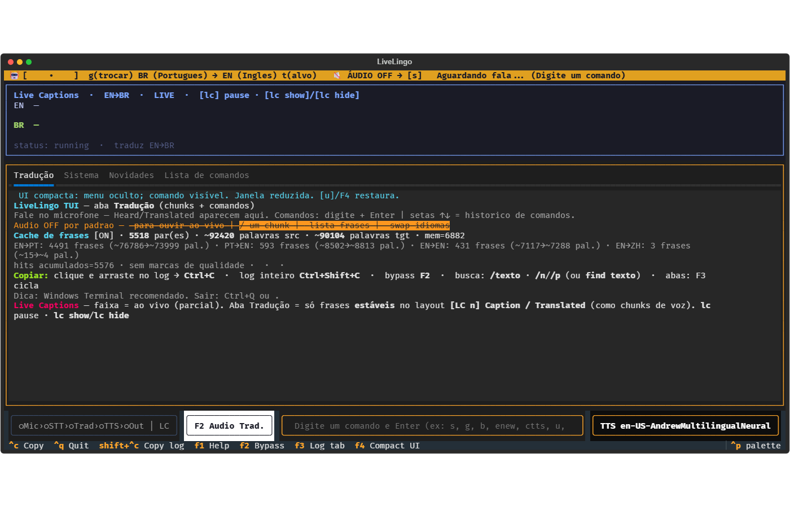
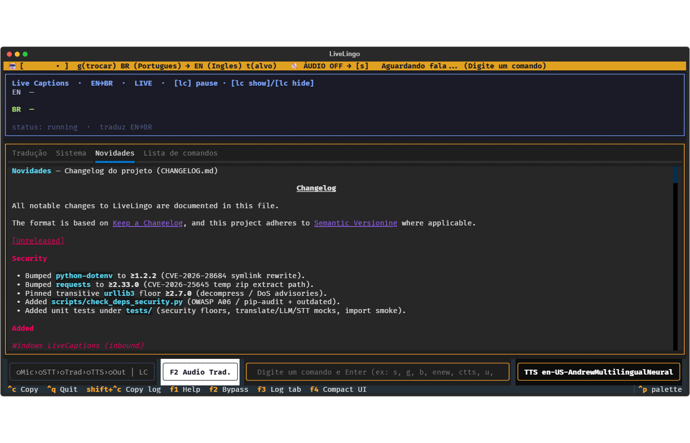
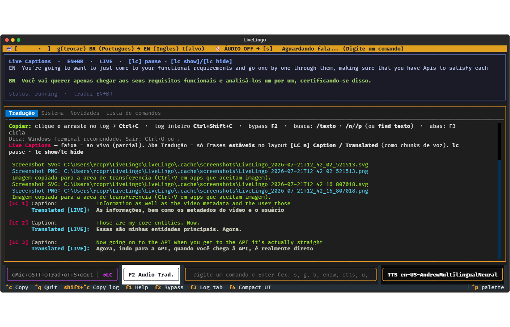

# LiveLingo2 — Screenshots / Capturas de tela

← **Back to** [README.md](README.md) · [README-ptbr.md](README-ptbr.md)

Product UI screenshots of the Textual TUI (`UI_MODE=tui`).  
Image files live under [`docs/screenshots/`](docs/screenshots/).

---

## Gallery

| # | File | Where it appears |
|---|------|------------------|
| 1 | [`live_lingo1.png`](docs/screenshots/live_lingo1.png) | Featured in [README-ptbr.md](README-ptbr.md) |
| 2 | [`live_lingo2.png`](docs/screenshots/live_lingo2.png) | This page |
| 3 | [`live_lingo3.png`](docs/screenshots/live_lingo3.png) | This page |
| 4 | [`live_lingo4.png`](docs/screenshots/live_lingo4.png) | Featured in [README.md](README.md) |

---

## 1 — Classic command menu (`live_lingo1`)

**What this shows**

- Full TUI chrome: language pair in the header (`BR → EN`), **ÁUDIO OFF**, listen status.
- Startup tips in the scrollable log (copy shortcuts, default muted TTS).
- Bottom **command strip** grouped by Frase / Áudio / Idioma (`[e]`, `[s]`, `[n]`, `[g]`, …).
- Command input line and footer shortcuts (`Ctrl+C`, `F1`, palette).

Typical first-run / “menu visible” layout before compact mode.

---

## 2 — Compact UI + Live Captions + phrase cache (`live_lingo2`)

**What this shows**

- **Live Captions** inbound strip (top): `EN→BR`, status `LIVE`, controls `[lc] pause` / `show` / `hide`.
- **Compact UI** (`[u]` / `F4`): command menu hidden; only the command field stays visible.
- **Tradução** tab: notes about phrase cache stats (pairs, words, hits) and Live Captions layout.
- Footer pipeline chips (`Mic → STT → Trad → TTS → Out | LC`), TTS voice, `F2` audio-trad. button.

Useful to document cache + captions + compact mode together.

---

## 3 — Novidades / Changelog tab (`live_lingo3`)

**What this shows**

- Live Captions strip idle (`EN` / `BR` lines empty, status `running`).
- Tab bar: **Tradução** · **Sistema** · **Novidades** · **Lista de comandos**.
- **Novidades** tab rendering project [`CHANGELOG.md`](CHANGELOG.md) (Security floors, LiveCaptions, etc.).
- Same compact footer (pipeline, command line, TTS voice).

How in-app “what’s new” tracks release notes without leaving the TUI.

---

## 4 — Live Captions + translated log (`live_lingo4`)

**What this shows**

- Live Captions **partial stream** (EN source + BR translation) while the session runs.
- **Tradução** log with stable **`[LC n]`** caption / translated pairs (inbound, parallel to voice).
- Screenshot export paths (SVG/PNG under `.cache/screenshots/`) and clipboard hints.
- Pipeline footer with **LC** active (`●LC`).

Main “product in a meeting” view — featured on the English [README.md](README.md).

---

## Notes

- Captures may be taken on Windows Terminal + WSL; host paths in logs can show `/mnt/c/...` or `C:\...`.
- Session content (captions, phrases) is sample data from demos — not part of the app binary.
- To regenerate screenshots from the TUI: use the screenshot command in the command palette (see README / help `F1`).

---

← **[README.md](README.md)** · **[README-ptbr.md](README-ptbr.md)**
